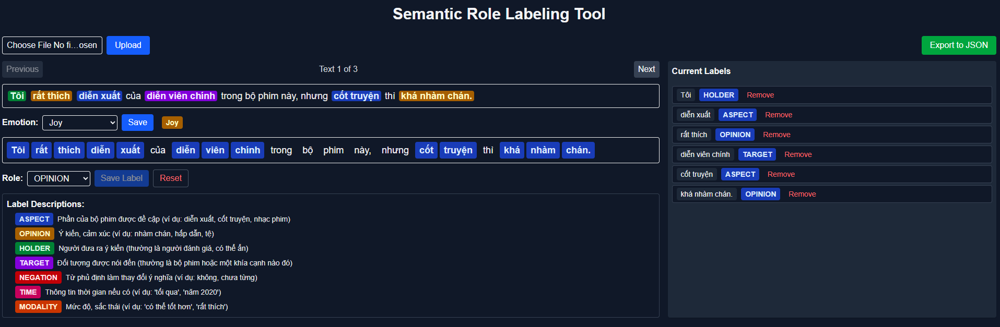

# Semantic Role Labeling Tool

A modern, browser-based tool for annotating text with semantic roles (SRL) and sentence-level emotions, designed for ease of use, Vietnamese language support, and efficient data labeling. No backend required—everything runs in your browser.

---

## Features
- **CSV Upload:** Import your data from a CSV file (only the `text` column is used).
- **Interactive Labeling:** Click words to select and assign semantic roles (e.g., ASPECT, OPINION, HOLDER, etc.).
- **Emotion Labeling:** Assign an overall emotion to each sentence (joy, sadness, anticipation, anger, optimism, surprise, fear, disgust), each with a color badge.
- **Highlighting:** Labeled spans are highlighted in the sentence for easy review.
- **Current Labels List:** See and remove all labels for the current sentence.
- **Export to JSON:** Download your labeled data in a structured JSON format.
- **Dark Mode Support:** UI adapts to your system theme.
- **Large, Vietnamese-friendly Font:** Uses 'Noto Sans' and large text for readability and full Vietnamese character support.
- **Fully Responsive:** Works on all screen sizes, from mobile to desktop.

---

## How to Use

### 1. Upload Data
- Click **"Choose File"** and select a CSV file from your computer.
- The tool will use only the `text` column from your CSV. If your CSV has a header, it must include a `text` column.
- Each row in the `text` column becomes a sentence to label.

### 2. Labeling Sentences
- Use the **Previous/Next** buttons to navigate between sentences.
- The sentence is shown at the top, with any existing labels highlighted in color.
- Below, each word is clickable. Click one or more words to select a span to label.
- Select a role from the **Role** dropdown (e.g., OPINION, ASPECT, etc.).
- Click **Save Label** to assign the role to the selected span.
- Labeled spans will be highlighted in the sentence and listed in the **Current Labels** panel on the right.
- To remove a label, click the **Remove** button next to it in the list.
- Click **Reset** to clear all labels for the current sentence.

### 3. Labeling Sentence-level Emotion
- Use the **Emotion** dropdown to select the overall emotion for the sentence.
- Options: 
  - <span style='background-color:#fde68a;color:#92400e;padding:2px 8px;border-radius:4px;font-weight:bold;'>Joy</span>
  - <span style='background-color:#bfdbfe;color:#1e3a8a;padding:2px 8px;border-radius:4px;font-weight:bold;'>Sadness</span>
  - <span style='background-color:#fdba74;color:#7c2d12;padding:2px 8px;border-radius:4px;font-weight:bold;'>Anticipation</span>
  - <span style='background-color:#fecaca;color:#991b1b;padding:2px 8px;border-radius:4px;font-weight:bold;'>Anger</span>
  - <span style='background-color:#bbf7d0;color:#166534;padding:2px 8px;border-radius:4px;font-weight:bold;'>Optimism</span>
  - <span style='background-color:#fbcfe8;color:#831843;padding:2px 8px;border-radius:4px;font-weight:bold;'>Surprise</span>
  - <span style='background-color:#ddd6fe;color:#5b21b6;padding:2px 8px;border-radius:4px;font-weight:bold;'>Fear</span>
  - <span style='background-color:#99f6e4;color:#134e4a;padding:2px 8px;border-radius:4px;font-weight:bold;'>Disgust</span>
- Click **Save** to assign the emotion. The current emotion is shown with a color badge.

### 4. Exporting Data
- When finished, click **Export to JSON**.
- The tool will download a `.json` file containing all your labeled data in the following format:

```json
[
  {
    "text": "Your sentence here.",
    "labels": [
      { "role": "ASPECT", "text": "...", "start": 0, "end": 5 },
      ...
    ],
    "sentiment": "joy" // or other emotion value
  },
  ...
]
```

---

## Labeling Best Practices
- <span style='background-color:#bfdbfe;color:#1e3a8a;padding:2px 8px;border-radius:4px;font-weight:bold;'>ASPECT</span>: Part of the subject being discussed (e.g., "diễn xuất", "cốt truyện").
- <span style='background-color:#fef08a;color:#713f12;padding:2px 8px;border-radius:4px;font-weight:bold;'>OPINION</span>: Words expressing sentiment or evaluation (e.g., "nhàm chán", "hấp dẫn").
- <span style='background-color:#bbf7d0;color:#166534;padding:2px 8px;border-radius:4px;font-weight:bold;'>HOLDER</span>: The person expressing the opinion (often the reviewer, e.g., "Tôi").
- <span style='background-color:#ddd6fe;color:#5b21b6;padding:2px 8px;border-radius:4px;font-weight:bold;'>TARGET</span>: The entity/aspect being discussed (e.g., "bộ phim", "diễn viên chính").
- <span style='background-color:#fecaca;color:#991b1b;padding:2px 8px;border-radius:4px;font-weight:bold;'>NEGATION</span>: Words that negate meaning (e.g., "không", "chưa từng").
- <span style='background-color:#fbcfe8;color:#831843;padding:2px 8px;border-radius:4px;font-weight:bold;'>TIME</span>: Temporal information (e.g., "tối qua", "năm 2020").
- <span style='background-color:#fed7aa;color:#7c2d12;padding:2px 8px;border-radius:4px;font-weight:bold;'>MODALITY</span>: Degree or modality (e.g., "có thể tốt hơn", "rất thích").

---

## Example Workflow
1. Upload your CSV file.
2. Click through each sentence, labeling relevant spans and assigning an emotion.
3. Remove or reset labels as needed.
4. Export your work to JSON for use in downstream NLP tasks.

---

## Screenshot

- Example UI:



---

## Development
- Built with Next.js, React, and Tailwind CSS.
- All data is processed in-browser for privacy and speed.
- Uses a large, Vietnamese-friendly font for accessibility and clarity.

